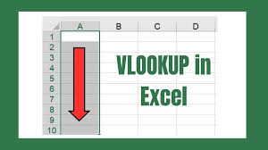

# Bike Sales Data Manipulation

Given an array of data, using Microsoft Excel, you can manipulate the data to quickly access desired information from the dataset using formatting functions or Vlookup feature.

## Objective
- To sort data by profit column and discover high profit-making orders (>$2000)
- To view details of individual sales orders contained in the dataset using just the sales order number.

## Project Activity
- Conditional Formatting
- Vlookup Function

## Results
- [Pre-view Table with Conditional Formatting](https://1drv.ms/x/c/9b7db70b6eea3a13/ETFV7cRcImJOn9cGjTROs1ABNzjeZuSiQP75mHvQNbs8YQ?e=sdob6j)  
  
     [View Raw](Bike_Sales_Manipulate_Lab_4.2.7.xlsx)
- [Pre-view Table with VLOOKUP](https://1drv.ms/x/c/9b7db70b6eea3a13/Ebg_ENWAcDNFk4BHZRhRUwYB8mJELqLddjsqtBD9fcH2cw?e=mG5Ol4) 

   [View Raw](Bike_Sales_VLOOKUP.xlsx)
